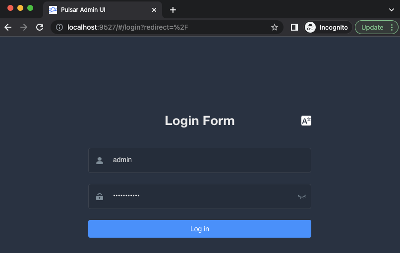
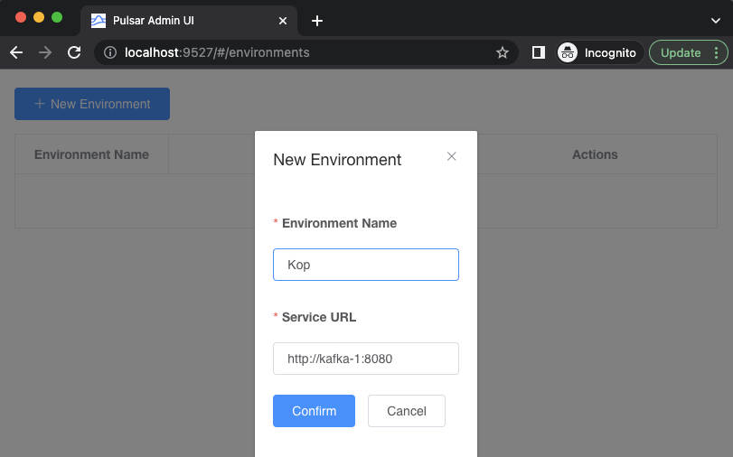

Is Using KoP (Kafka-On-Pulsar) a Good Idea?
===========================================

Building microservices around Apache Kafka is your job, and life is great. One day, you hear community members talking about some neat Apache Pulsar features, and get you intrigued. I mean, we all love Kafka, but you can't avoid wondering if migrating one of your projects to Pulsar is a good idea. Then it happens. You find Pulsar supports Kafka clients natively via a [protocol handler](https://github.com/apache/pulsar/wiki/PIP-41:-Pluggable-Protocol-Handler) called KoP: [Kafka-On-Pulsar](https://github.com/streamnative/kop).

This gets you pumped. Is that it? Can I go ahead and simply point my microservices to Pulsar and be a hero with this migration? But you must be responsible; and history says you shouldn't believe migrations like this are refactoring free. This is why you may get interested in what this repository offers. To prove that KoP is worth your time, use it in scenarios that would really put the technology to stress, going way beyond the bread-and-buttter of producing and consuming messages. Follow the instructions below to test KoP in the following scenarios:

- **Microservice built for Apache Kafka**: microservice written in [Spring Boot](https://spring.io/projects/spring-boot), that connects to a "Kafka Cluster" using two endpoints exposed by Apache Pulsar with KoP enabled.

- **CDC using Debezium for MySQL**: Kafka Connect with a connector from [Debezium](https://debezium.io) to capture in near real-time changes made to a [MySQL](https://www.mysql.com) database. Kafka Connect uses an endpoint exposed by Apache Pulsar with KoP enabled.

- **Stream processing using ksqlDB**: Stream processing pipeline using [ksqlDB](https://ksqldb.io) to flat out events produced to Kafka. ksqlDB uses an endpoint exposed by Apache Pulsar with KoP enabled.

💡 This repository was created as part of the session entitled **Is Using KoP (Kafka-On-Pulsar) a Good Idea?** delivered in the [Pulsar Summit 2022](https://pulsar-summit.org/event/san-francisco-2022) conference, in San Francisco, CA. Click in the image below to access slides and recording of this session.

[](https://talks.riferrei.com/LgUiHy)

Requirements
------------

- [Docker](https://www.docker.com/get-started) 4.11+
- [Java](https://openjdk.org/install/) 17+
- [Maven](https://maven.apache.org/download.cgi) 3.8.6+
- [Apache Pulsar](https://pulsar.apache.org/download) 2.10.1+
- [Confluent Platform](https://www.confluent.io/get-started/?product=software) 7.0.5+

🏢 Shared Apache Pulsar Infrastructure
--------------------------------------

Before jumping into any of the scenarios, you must start the shared infrastructure all of them will use. This includes one Zookeeper instance, two Bookkeepers, and two Pulsar brokers.

1️⃣ Start the persistence layer

```bash
sh start-persistence.sh
```

👀 You must wait until the containers `zookeeper`, `persistence-bookie-1`, and `persistence-bookie-2` are healthy to proceed with the next step.

2️⃣ Start the Pulsar brokers with KoP enabled

```bash
sh start-brokers.sh
```

👀 You must wait until the containers `kafka-1` and `kafka-2` are healthy to proceed with any next step.


3️⃣ Start the control plane (Optional)

```bash
sh start-control-plane.sh
```

👀 You must wait until the container `pulsar-manager` is healthy before you can access the UI and create an environment. Once the container is running, you should see a screen similar to the following when you visit [http://localhost:9527](http://localhost:9527). Enter `admin` for the username and `apachepulsar` as the password.



Next, you will need to add an environment to the Pulsar Manager. An environment represents a Pulsar instance or a group of clusters you want to manage. A Pulsar Manager is capable of managing multiple environments.

Click "New Environment" button to add an environment.
Input the "Environment Name". The environment name is used for identifying an environment.
Input the "Service URL". The Service URL is the admin service url of your Pulsar cluster.
You need to make sure the service url that Pulsar Manager is able to access. In this example, both the pulsar container and pulsar-manager container use the same docker network. So you can use pulsar container name as the domain name of the pulsar standalone cluster. Thus you can type http://kafka-1:8080 in the service URL box and click on the `confirm` button.



This will create the environment and allow you to manage the Pulsar cluster from the Pulsar Manager UI.


✅ Scenario: Microservice built for Apache Kafka
-------------------------------------------------

This scenario checks two things. First, if KoP provides a truly Kafka-compatible API where third-party frameworks such as [Spring Boot](https://spring.io/projects/spring-boot) can connect with without deployment problems. Second, to check whether KoP is capable of mimic the distributed protocol from Kafka. Kafka is not just a one-directional typical client-server protocol. Instead, it is a bi-directional protocol where messages are exchanged from both parties. A good example is when a producer connects to the Kafka cluster using one bootstrap server endpoint, and the cluster keeps periodically updating that list back to the producer with metadata about the new cluster formation. Same for the consumer, which after joining a group, may be eventually removed by the cluster for the absence of valid heartbeats.

To validate this scenario, two Apache Pulsar brokers with KoP enabled will be executed, and the microservice will use the endpoint of only one broker to bootstrap the cluster. When everything is up-and-running and working as expected, the broker being used by the microservice will be killed, and the assumption is that the microservice should fallback to the other available broker, and continue its execution. If that ever happens, it means that the bootstrap worked as expected, giving the specifications of how Kafka manages clusters and sends this information to its clients.

1️⃣ Run the Spring Boot microservice

```bash
sh microservice-with-kafka/run-microservice.sh
```

👀 You must wait until the microservice connects with the brokers and start producing and consuming messages like this:

```console
org.summit.pulsar.demo.FiveSecondsTom : Hi, I'm Tom 😄
```

2️⃣ Find out which broker is the leader of the partition

```bash
$PULSAR_HOME/bin/pulsar-admin --admin-url http://localhost:8081 topics lookup persistent://public/default/fiveSecondsTomTopic
```

👀 Take a note of which broker shows up in this lookup.

3️⃣ Forcing a fail-over situation by killing the leader

```bash
sh kill-broker.sh <BROKER_CONTAINER_NAME_FROM_STEP_TWO>
```

👀 Observe the microservice for a couple minutes. It must continue its processing.

#️⃣ stop all containers if you're done for the day.

```bash
sh stop-everything.sh
```

✅ Scenario: CDC using Debezium for MySQL
-----------------------------------------

One of the most popular use cases for [Apache Kafka](https://kafka.apache.org) is using it to replicate data from relational databases to purpose-built systems, while Kafka acts as a persistent layer for the data streams. To enable this use case, [Kafka Connect](https://kafka.apache.org/documentation/#connect), which is an integration technology from the Kafka ecosystem, is usually used with connectors capable of pulling data from relational databases either using a polling query or via CDC (Change-Data Capture).

This scenario check if an [Apache Pulsar](https://pulsar.apache.org) broker with [KoP](https://github.com/streamnative/kop) enabled can be used as the data stream layer for Kafka Connect, which uses a connector from [Debezium](https://debezium.io) to stream data changes made in near real-time in a [MySQL](https://www.mysql.com) database. The validation process is very simple: you just need to set this up as you would using Apache Kafka — but use Apache Pulsar with KoP enabled instead. Everything must work as advertised.

1️⃣ Start the containers for this scenario

```bash
sh start-cdc-with-debezium.sh
```

👀 You must wait until the containers `mysql` and `connect` are healthy to proceed with the next step.

2️⃣ Connect with the MySQL database and check the data

```bash
docker compose -f cdc-with-debezium/docker-compose.yml exec mysql bash -c 'mysql -u $MYSQL_USER -p$MYSQL_PASSWORD cdc_with_debezium'
```

Then, in the MySQL shell, execute the following command:

```sql
select * from customers;
```

You should see an output like this:

```console
+------+------------+-----------+-----------------------+
| id   | first_name | last_name | email                 |
+------+------------+-----------+-----------------------+
| 1001 | Sally      | Thomas    | sally.thomas@acme.com |
| 1002 | George     | Bailey    | gbailey@foobar.com    |
| 1003 | Edward     | Walker    | ed@walker.com         |
| 1004 | Anne       | Kretchmar | annek@noanswer.org    |
+------+------------+-----------+-----------------------+
```

3️⃣ Deploy the Debezium connector

```bash
curl -i -X POST -H "Accept:application/json" -H  "Content-Type:application/json" http://localhost:8083/connectors/ -d @cdc-with-debezium/mysql-connector.json
```

To verify if the connector has been sucessfully deployed, execute the following command:

```bash
curl -X GET http://localhost:8083/connectors/cdc-with-debezium
```

You should see an output like this:

```json
{"name":"cdc-with-debezium","config":{"connector.class":"io.debezium.connector.mysql.MySqlConnector","database.user":"debezium","database.server.id":"184054","tasks.max":"1","database.hostname":"mysql","database.password":"dbz","database.history.kafka.bootstrap.servers":"kafka-1:9092,kafka-2:9093","database.history.kafka.topic":"dbhistory.cdc_with_debezium","name":"cdc-with-debezium","database.server.name":"mysql","database.port":"3306","database.include.list":"cdc_with_debezium"},"tasks":[{"connector":"cdc-with-debezium","task":0}],"type":"source"}
```

4️⃣ Use the `kafka-console-consumer` to monitor data streams

```bash
$KAFKA_HOME/bin/kafka-console-consumer --bootstrap-server localhost:9092 --topic mysql.cdc_with_debezium.customers
```

👀 Leave this console open so you can see the data coming in.

5️⃣ Insert a new record into the `customers` table.

```bash
docker compose -f cdc-with-debezium/docker-compose.yml exec mysql bash -c 'mysql -u $MYSQL_USER -p$MYSQL_PASSWORD cdc_with_debezium'
```

Then, in the MySQL shell, execute the following command:

```sql
insert into customers values (1006, "Ricardo", "Ferreira", "riferrei@riferrei.com");
```

6️⃣ Look to the `kafka-console-consumer` output. You should see an output like this:

```console
Struct{after=Struct{id=1006,first_name=Ricardo,last_name=Ferreira,email=riferrei@riferrei.com},source=Struct{version=1.9.3.Final,connector=mysql,name=mysql,ts_ms=1660957053000,db=cdc_with_debezium,table=customers,server_id=1,file=binlog.000002,pos=406,row=0,thread=36},op=c,ts_ms=1660957053478}
```

#️⃣ Stop the containers from this scenario.

```bash
sh stop-cdc-with-debezium.sh
```

Alternatively, you can also stop all containers if you're done for the day.

```bash
sh stop-everything.sh
```

### This scenario was created based on the following tutorial:

🧑🏻‍💻 https://github.com/debezium/debezium-examples/tree/main/tutorial#using-mysql

✅ Scenario: Stream processing using ksqlDB
-------------------------------------------

Another popular use case for [Apache Kafka](https://kafka.apache.org) is using it as a persistent layer for stream processing pipelines. The idea is to have events being stored into Kafka, and stream processing technologies such as [Kafka Streams](https://kafka.apache.org/documentation/streams), [ksqlDB](https://ksqldb.io), [Apache Flink](https://flink.apache.org) be able to execute event processing pipelines that compute near real-time results as new events arrive.

This scenario check if an [Apache Pulsar](https://pulsar.apache.org) broker with [KoP](https://github.com/streamnative/kop) enabled can be used as the data stream layer for ksqlDB, which implements a stream processing pipeline that flattens out events with a complex nested layout and also changes the data format from [JSON](https://www.json.org/json-en.html) to [Protobuf](https://developers.google.com/protocol-buffers). The validation process is very simple: you just need to set this up as you would using Apache Kafka — but use Apache Pulsar with KoP enabled instead. Everything must work as advertised.

1️⃣ Start the containers for this scenario

```bash
sh start-stream-processing.sh
```

👀 You must wait until the containers `schema-registry` and `ksqldb-server` are healthy to proceed with the next step.

2️⃣ Connect with the ksqlDB server via CLI:

```bash
$KAFKA_HOME/bin/ksql http://localhost:8088
```

Then, in the ksqlDB shell, execute the following command:

```sql
RUN SCRIPT 'stream-processing/statements.sql';
```

Once this command finishes, you should have two streams created. Before moving further, it is a good idea to check if they were really created by executing the following command:

```sql
SHOW STREAMS;
```

You should see an output like this:

```console
 Stream Name      | Kafka Topic      | Key Format | Value Format | Windowed 
----------------------------------------------------------------------------
 FLATTENED_ORDERS | FLATTENED_ORDERS | KAFKA      | PROTOBUF     | false    
 ORDERS           | ORDERS           | KAFKA      | JSON         | false    
----------------------------------------------------------------------------
```

3️⃣ Execute a continuous query

```sql
SELECT
    ORDER_ID,
    ORDER_TS,
    ORDER_AMOUNT,
    CUST_FIRST_NAME,
    CUST_LAST_NAME,
    CUST_PHONE_NUMBER,
    CUST_ADDR_STREET,
    CUST_ADDR_NUMBER,
    CUST_ADDR_ZIPCODE,
    CUST_ADDR_CITY,
    CUST_ADDR_STATE,
    PROD_SKU,
    PROD_NAME,
    PROD_VENDOR_NAME,
    PROD_VENDOR_COUNTRY
FROM FLATTENED_ORDERS
EMIT CHANGES;
```

👀 This query never stops, unless you press Cmd+C to interrupt its execution. Leave this console open so you can see the data coming in.

4️⃣ Ingest data into the input topic

```bash
$KAFKA_HOME/bin/kafka-console-producer --bootstrap-server localhost:9092 --topic ORDERS
```

Copy-and-paste the events below to the `kafka-console-producer` CLI:

```json
{"id": "1", "timestamp": "2020-01-18 01:12:05", "amount": 84.02, "customer": {"firstName": "Ricardo", "lastName": "Ferreira", "phoneNumber": "1234567899", "address": {"street": "Street SDF", "number": "8602", "zipcode": "27640", "city": "Raleigh", "state": "NC"}}, "product": {"sku": "P12345", "name": "Highly Durable Glue", "vendor": {"vendorName": "Acme Corp", "country": "US"}}}
{"id": "2", "timestamp": "2020-01-18 01:35:12", "amount": 84.02, "customer": {"firstName": "Tim", "lastName": "Berglund", "phoneNumber": "9987654321", "address": {"street": "Street UOI", "number": "1124", "zipcode": "85756", "city": "Littletown", "state": "CO"}}, "product": {"sku": "P12345", "name": "Highly Durable Glue", "vendor": {"vendorName": "Acme Corp", "country": "US"}}}
{"id": "3", "timestamp": "2020-01-18 01:58:55", "amount": 84.02, "customer": {"firstName": "Robin", "lastName": "Moffatt", "phoneNumber": "4412356789", "address": {"street": "Street YUP", "number": "9066", "zipcode": "BD111NE", "city": "Leeds", "state": "YS"}}, "product": {"sku": "P12345", "name": "Highly Durable Glue", "vendor": {"vendorName": "Acme Corp", "country": "US"}}}
{"id": "4", "timestamp": "2020-01-18 02:31:43", "amount": 84.02, "customer": {"firstName": "Viktor", "lastName": "Gamov", "phoneNumber": "9874563210", "address": {"street": "Street SHT", "number": "12450", "zipcode": "07003", "city": "New Jersey", "state": "NJ"}}, "product": {"sku": "P12345", "name": "Highly Durable Glue", "vendor": {"vendorName": "Acme Corp", "country": "US"}}}

```

5️⃣ Verify if the pipeline executed correctly

Go back to the continuous query that you started on step 3️⃣. With new events arriving, you should see that the query generated an output similar to this:

```console
+-----------+--------------+-----------------+-----------------+-----------------+-----------------+-----------------+------------+----------------------+
|ORDER_ID   |ORDER_AMOUNT  |CUST_FIRST_NAME  |CUST_LAST_NAME   |CUST_PHONE_NUMBER|CUST_ADDR_STREET |CUST_ADDR_NUMBER |PROD_SKU    |PROD_NAME             |
+-----------+--------------+-----------------+-----------------+-----------------+-----------------+-----------------+------------+----------------------+
|1          |84.02         |Ricardo          |Ferreira         |1234567899       |Street SDF       |8602             |P12345      |Highly Durable Glue   |
|2          |84.02         |Tim              |Berglund         |9987654321       |Street UOI       |1124             |P12345      |Highly Durable Glue   |
|3          |84.02         |Robin            |Moffatt          |4412356789       |Street YUP       |9066             |P12345      |Highly Durable Glue   |
|4          |84.02         |Viktor           |Gamov            |9874563210       |Street SHT       |12450            |P12345      |Highly Durable Glue   |
```

💡 The actual output includes more columns that what is shown above.

#️⃣ Stop the containers from this scenario

```bash
sh stop-stream-processing.sh
```

Alternatively, you can also stop all containers if you're done for the day.

```bash
sh stop-everything.sh
```

### This scenario was created based on the following tutorial:

🧑🏻‍💻 https://developer.confluent.io/tutorials/flatten-nested-data/ksql.html

# License

This project is licensed under the [Apache 2.0 License](./LICENSE).
